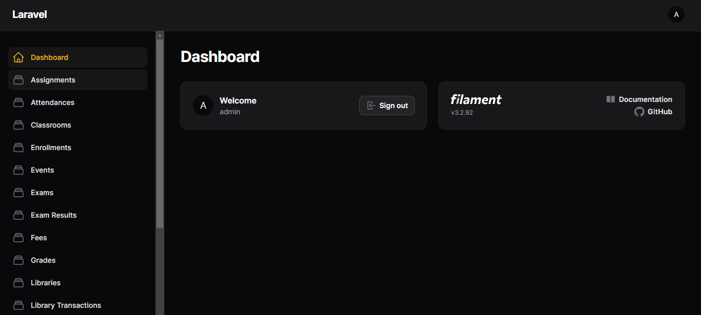
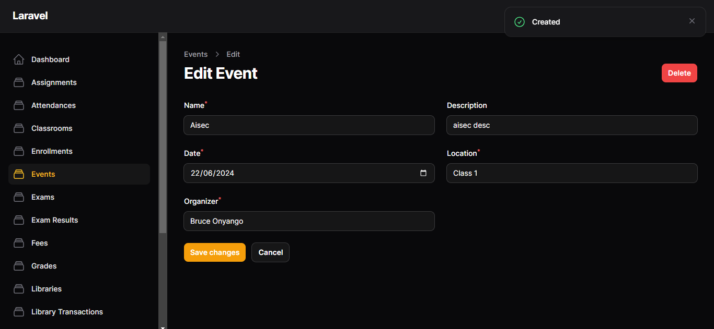
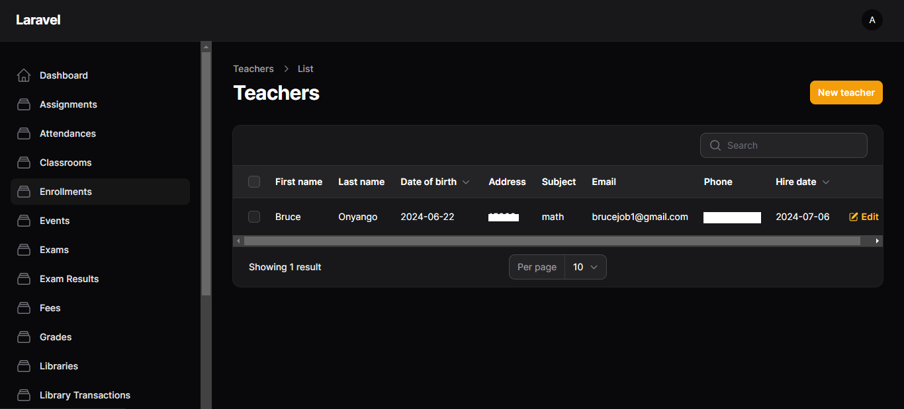

# Laravel Admin Panel Setup with Filament

## Overview

This README provides a basic guide on setting up an admin panel using the Filament package in a Laravel application. It includes instructions for setting up the project and collaborating with others.

## What It Is

This project is a Laravel application with an admin panel built using the Filament package. It allows administrators to manage resources through a web interface, providing functionalities to create, read, update, and delete entries in the database.

## How to Set Up

### Prerequisites

- PHP 8.0 or higher
- Composer
- Laravel 8 or higher
- Filament Admin Panel package

### Installation

1. **Clone your forked repository:**

    ```
        git clone https://github.com/BruceOnyango/school-mgt.git
        cd school-mgt
    ```

2. **Create a new branch for your feature or bugfix:**

    ```
        git checkout -b feature-or-bugfix-name
    ```

3. **Make your changes and commit them:**

    ```
        git add .
        git commit -m "Description of the changes"
    ```

4. **Push to your branch:**

    ```
        git push origin feature-or-bugfix-name
    ```

5. **Create a Pull Request:**

Go to the original repository on GitHub and click on "New Pull Request" to submit your changes for review.
  

### Contact

For any questions or support, please contact brucejob1@gmail.com or create an issue in the repository.

# Dashboard


# EditData Modal


# Sample Output Data

